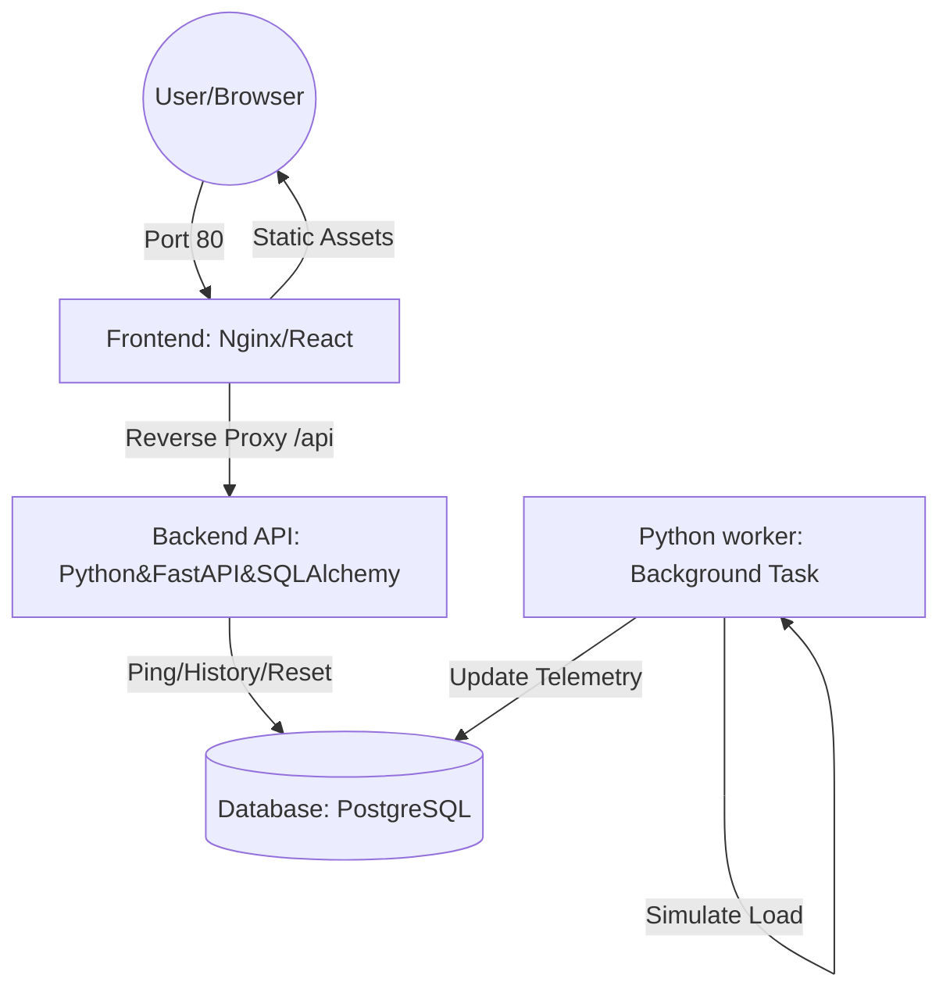

# Void-Watcher: The Cosmic Infrastructure Observer

**Void-Watcher** is a production-like microservices simulation system designed to monitor deep-space objects (e.g., Black Hole Phoenix A). This project serves as a comprehensive DevOps sandbox to practice Infrastructure as Code (IaC), container orchestration, and full-stack observability.

---

## System Architecture

The project is built using a decoupled microservices approach to ensure scalability and fault tolerance.



1. Frontend (Nginx + React/Vite)
2. Backend API (Python FastAPI/SQLAlchemy) - currently we have ping, history(which displays all last 20 database records), and resetting database(with ids) functions.
3. Worker (Python) - imitates black holes accreation and hawking radiation every 15 seconds.
4. Database (PostgreSQL)

To run that project you need to do several steps:
```bash
    git clone https://github.com/zweihaka/void-watcher.git
    cd void-watcher
    docker compose up -d
```
For updating do that:
```bash
    cd void-watcher
    git pull origin main
    docker compose up -d --build
```
