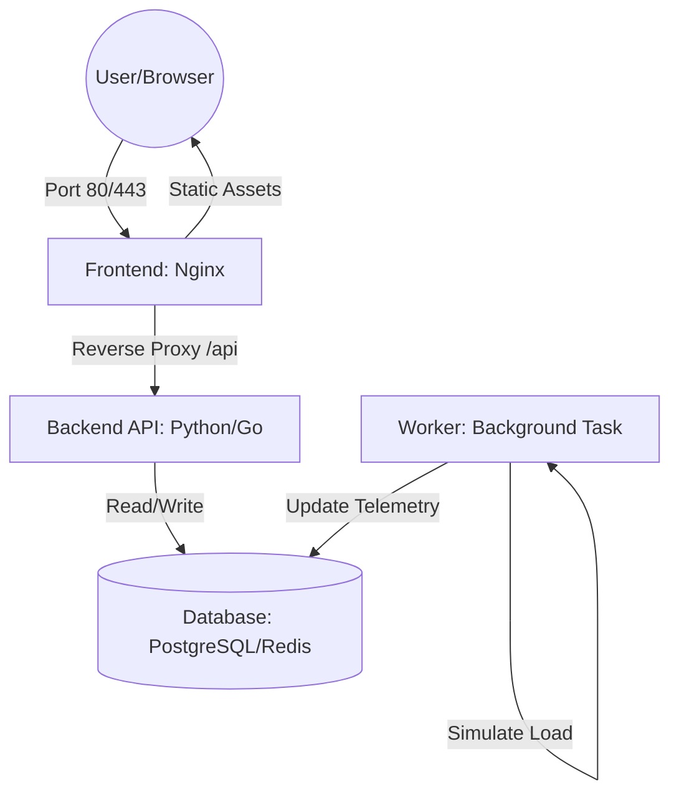

# Void-Watcher: The Cosmic Infrastructure Observer

**Void-Watcher** is a production-grade microservices simulation system designed to monitor deep-space anomalies (e.g., Black Hole Phoenix A). This project serves as a comprehensive DevOps sandbox to practice Infrastructure as Code (IaC), container orchestration, and full-stack observability.

---

## System Architecture

The project is built using a decoupled microservices approach to ensure horizontal scalability and fault tolerance.

1. Frontend (Nginx + React/Static)

    Role: The entry point for all traffic.

    DevOps Task: Configure Nginx as a Reverse Proxy. It handles routing between static assets and the API gateway, abstracting the internal network from the client.

    Production Goal: Decouple UI delivery from backend logic.

2. Backend API (Stateless Service)

    Role: Application logic and database interaction.

    DevOps Task: Keep the service strictly Stateless. Any instance must be able to handle any request, allowing for seamless horizontal scaling via replicas.

    Production Goal: High availability and standardized API responses.

3. Worker (Background Processor)

    Role: Simulates asynchronous heavy computational tasks or "Telescope Polling."

    DevOps Task: Generate randomized telemetry data for "Phoenix A" and update the database independently of the user-facing API.

    Production Goal: Decouple time-consuming tasks from the main request/response cycle.

4. Database (PostgreSQL)

    Role: Persistent storage for telemetry history.

    DevOps Task: Implement Docker Volumes for data persistence. Ensure that data survives container restarts and migrations.

    Production Goal: Data integrity and persistence.
